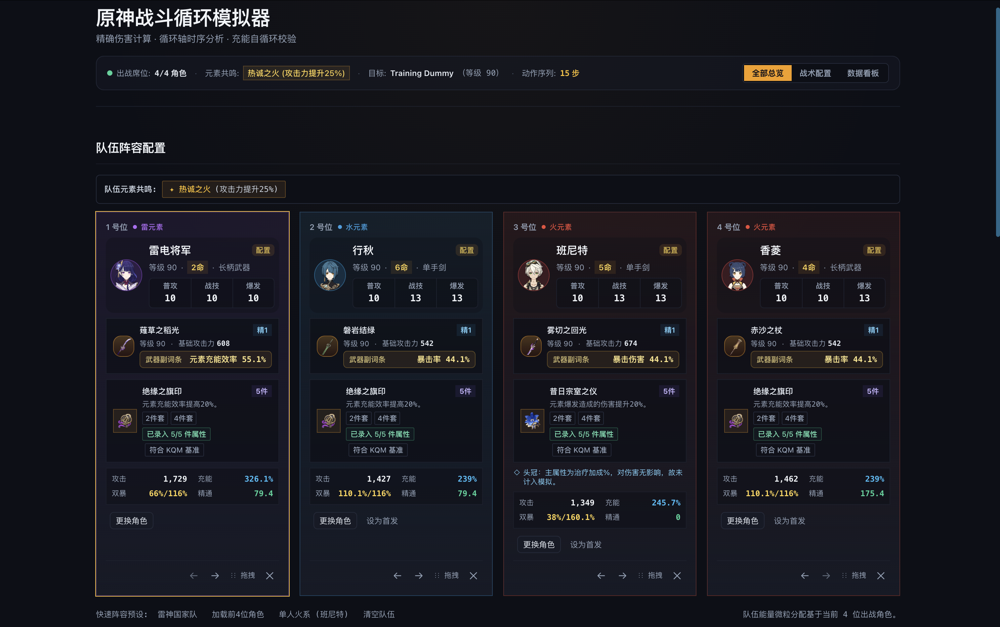

# 原神战斗循环模拟器 | Genshin Combat Optimizer

一个中文优先、确定性的《原神》战斗循环模拟器与有限预算循环搜索工具。项目把角色、武器、圣遗物、反应、能量、冷却、敌人状态和动作时序接入同一条可复现的 TypeScript 模拟链路，帮助你检查循环是否能运行、伤害从哪里来，以及当前数据和机制覆盖到什么程度。

> 当前状态：本地开发项目，仍在持续补齐角色和条件机制。结果只代表仓库当前已建模的范围，不代表完整游戏实机表现。

## 当前能力

- 首页工作台：队伍配置、等级/天赋/命座、武器等级与精炼、圣遗物槽位和属性编辑。
- 战斗设置：敌人等级、元素抗性、暴击模式、切人耗时和动作序列。
- 确定性事件模拟：多段伤害、天赋等级、角色/装备增益、元素附着与反应、ICD、敌人减抗/减防、能量和冷却。
- 结果看板：总伤害、DPS、时间线、按角色/技能/元素的伤害拆分、能量记录和基于已发出事件的战术洞察。
- 循环搜索：以模拟器为黑盒进行有限预算 beam search，按总伤害或 DPS 排序候选循环，并返回候选身份、预算、深度和停止原因。
- 可恢复状态：模拟快照、资源、治疗/拾取等已声明事件可序列化并恢复；输入指纹用于识别过期结果。
- 推荐配装：角色加入队伍时自动套用 KQM 基准；每件圣遗物生成 20 级四词条（4 条副词条、5 次强化），避免副词条重复主词条。
- 圣遗物数值：副词条统一显示 1 位小数，采用真实五星圣遗物的四档强化值；满级推荐数值可直接在编辑器中修改。
- 数据与覆盖页：角色支持状态按“有来源、已建立表示、可执行、已接入运行链路、已有回归测试”分别展示，不合并为一个容易误导的百分比。
- 辅助页面：`/coverage` 覆盖情况、`/history` 本次会话历史、`/compare` A/B 对比入口、`/projects` 本地项目与 ReplayPack 导入/导出。

当前实现仍有限制：搜索前端使用受边界约束的本地调用；Worker 进度、真正的取消和排队生命周期仍是后续工作。随机被动、动画帧/硬直、多目标状态、部分外部状态触发机制等不会被擅自假设为已覆盖。源数据只读不到或来源冲突时，生成器和运行时会保留未验证状态或 fail closed。

## 截图

当前本地 dashboard 首页：



## 快速开始

需要 Node.js 和 npm。

```bash
npm install
npm run dev
```

打开 <http://localhost:3000/>。首页默认加载可编辑的示例队伍和动作序列；点击“执行循环模拟”查看数据看板。页面也支持通过 URL 保存部分工作区状态。

## 开发与验证

```bash
npm run dev        # 启动 Next.js 开发服务器
npm run build      # 生产构建
npm run start      # 启动生产构建
npm run typecheck  # TypeScript 严格检查
npm run lint       # ESLint
npm run test       # Vitest 全量测试
npm run test:watch # Vitest 监听模式
```

## 架构概览

项目保持单向分层，模拟核心不依赖 React、DOM 或 IO：

```text
src/game-data                         角色、武器、圣遗物、敌人和预设数据
      ↓
src/simulation/reactions, buffs       元素反应、光环、ICD、增益与敌人修正
      ↓
src/simulation/engine, damage, energy,
src/simulation/cooldowns              状态、事件、验证、伤害、能量和冷却
      ↓
simulateRotation()                    确定性战斗时间线
      ↓
src/simulation/optimizer              以模拟器为黑盒的循环搜索
      ↓
src/app, src/components, src/features Next.js / React 工作台和展示适配器
```

主要公共接口：

- `simulateRotation(team, rotation, enemy, config?)`
- `validateAction()`、`computeDamage()`
- `getActiveBuffs(time, state)` 及反应/增益相关纯函数
- `optimizeRotation(team, enemy, config, simConfig?)`

前端只通过适配器消费模拟接口，不在组件内重算伤害或反应。优化器也不复制战斗规则，而是调用 `simulateRotation()`。

## 数据、来源与可信度

- 角色数据由 `src/game-data/characters/generated/` 生成，带有逐等级曲线、支持声明和 provenance；注册表不是手写角色清单。
- 武器生成流程使用 [Project Amber](https://gi.yatta.moe/) 作为主数据源、[Lunaris](https://lunaris.moe/) 作为独立校验源，并把未验证字段和来源冲突保留下来。
- 推荐配装是手工整理的 KQM 基准数据，位于 `src/game-data/characters/recommendedBuildsData.ts`。它是起始配置，不是对所有队伍的唯一正确答案。
- 推荐圣遗物副词条参考 [Game8 Artifact Score Checker](https://game8.co/games/Genshin-Impact/archives/476385) 的评分思路，并使用 [Genshin Impact Wiki — Artifact/Stats](https://genshin-impact.fandom.com/wiki/Artifact/Stats) 的五星副词条强化档位；这些是可复现的比较基准，不是玩家实际库存。
- 伤害公式和机制审计参考 [KQM Raiden Guide](https://keqingmains.com/raiden/) 与 [KQM TCL Raiden tables](https://library.keqingmains.com/characters/electro/raiden-shogun)，以及仓库 `docs/` 中记录的具体来源。KQM 内容属于其原作者和网站，不属于本项目。
- 图标和部分展示资源使用数据记录中的 Project Amber / Yatta 来源，并保留备用来源；外部资源可能变更、限流或失效。

“有来源”“已展示”“可执行”“已接入运行链路”“有回归测试”是不同事实。一个效果有来源或在 UI 展示，不等于它已经进入伤害计算。覆盖页和生成器会保留这种区分。

## 贡献指南

1. 先阅读 [AGENTS.md](AGENTS.md)、[docs/ARCHITECTURE.md](docs/ARCHITECTURE.md) 和 [docs/PROJECT-STATUS.md](docs/PROJECT-STATUS.md)。
2. 按分层和 ownership 修改：游戏数据、机制、战斗引擎、优化器和前端不要互相复制逻辑。
3. 新数据必须带来源；无法核验的数字应标为未验证，不要用看似合理的值填补空白。
4. 修改公共 API 前先搜索调用方，并同步架构说明；重要行为随改动添加测试。
5. 提交前运行 `npm run typecheck`、`npm run lint`、`npm run test`，必要时运行 `npm run build`，并检查 `git diff --check`。

## 致谢

感谢 KQM 社区的机制研究和配装资料；感谢 Project Amber、Lunaris/Yatta 等数据与图标来源；感谢参与本项目审计、测试和设计的贡献者。

## 许可证

仓库包含 [MIT License](LICENSE)，版权声明为 Vincent Tang © 2026。MIT 许可只适用于本仓库在许可证覆盖范围内的代码和文件；第三方数据、图标、名称、文本和游戏知识产权不因此转让给本项目。

## 第三方与知识产权声明

本项目是非官方工具，与 miHoYo、HoYoverse、KQM、Project Amber、Lunaris 或 Yatta 无隶属关系，也不代表这些组织。Genshin Impact、角色/武器/圣遗物名称、图像、文本和相关商标归其各自权利人所有。请遵守第三方站点的使用条款和数据许可；不要把本项目结果当作官方数据、投资建议或游戏内保证。
